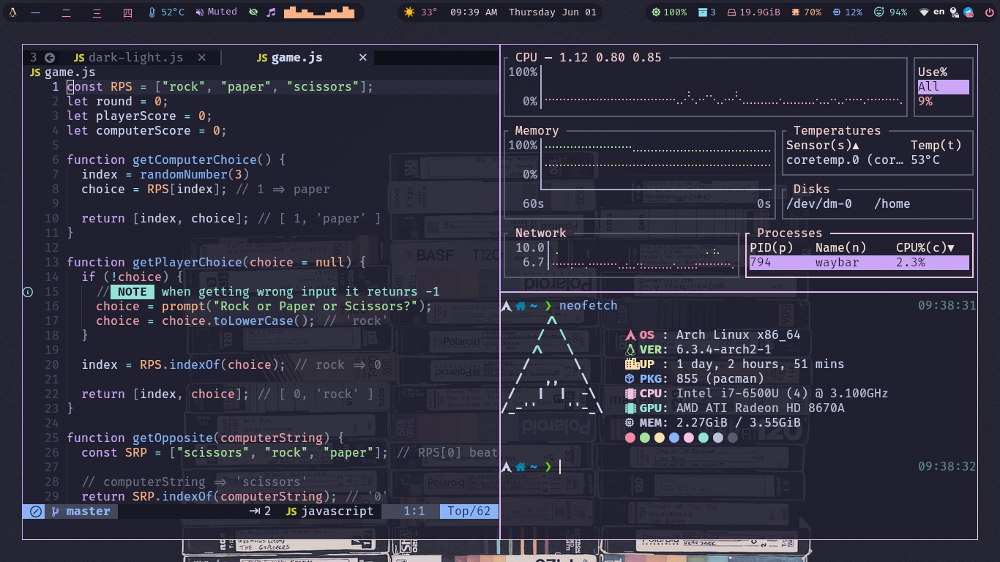
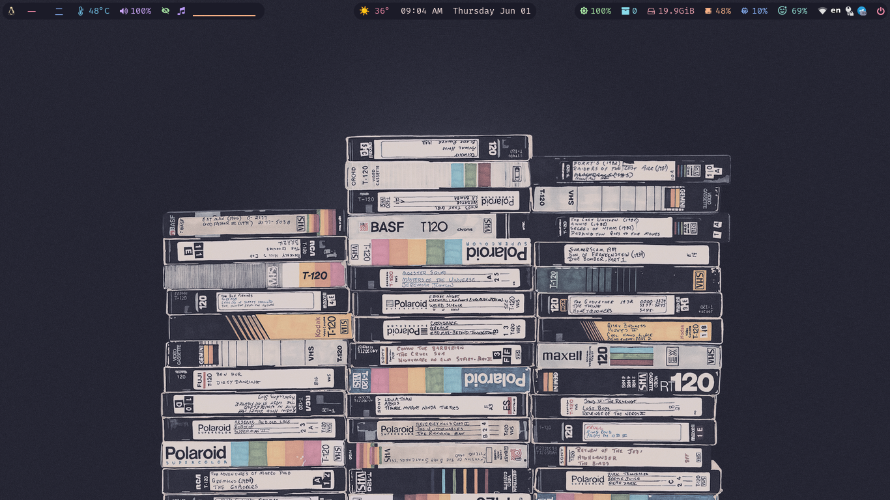
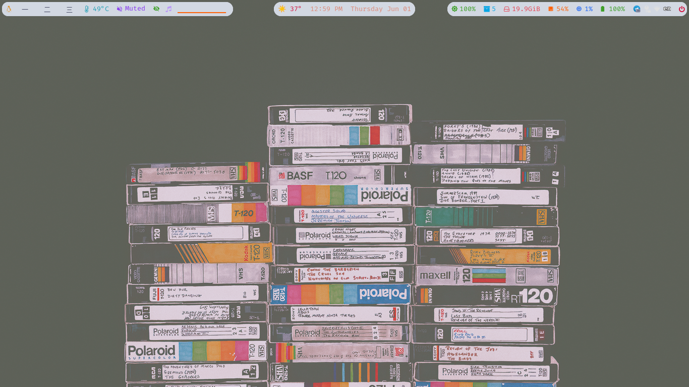

<h3 align="center">
	<br/>
    :space_invader: Aesthetic SwayWM Catppuccin Environment
</h3>

<p align="center">
  
</p>

<p align="center">
	<a href="https://github.com/i4pg/dotfiles/stargazers">
		</a>
	<a href="https://github.com/i4pg/dotfiles/issues">
		</a>
        
        </p>
</p>

## Dark/Light mode :waxing_crescent_moon:

  
  
  

> _left-click on waybar clock switches between latte/mocha scheme_

----------

## Configuration :computer:

+ **OS**							• [`arch`](https://archlinux.org/)
+ **WM**							• [`sway`](https://swaywm.org/)
+ **Bar**							• [`waybar`](https://github.com/Alexays/Waybar)
+ **Launcher**						• [`wofi`](https://man.archlinux.org/man/wofi.1.en)
+ **Theme**							• [`catppuccin`](https://catppuccin.com/)
+ **Font**							• [`Fira Code (Nerd)`](https://github.com/ryanoasis/nerd-fonts)
+ **Shell**							• [`fish`](https://fishshell.com/) 
+ **Terminal**						• [`kitty`](https://sw.kovidgoyal.net/kitty/) 
+ **Editor**						• [`LunarVim`](https://www.lunarvim.org/)
+ **Daemon**					• [`Swww`](https://github.com/Horus645/swww) 
+ **Resource monitor**				• [`btm`](https://github.com/ClementTsang/bottom)
+ **File Manager**							• [`fm`](https://github.com/knipferrc/fm)
+ **Reader**							• [`zathura`](https://pwmt.org/projects/zathura/) 
+ **Browser**						• [`firefox`](https://www.mozilla.org/en-US/firefox/new/)
+ **Wallpapers**						• [`Here`](https://discord.com/channels/907385605422448742/1111932660651135006) 

----------
  
## Installation

1.  First you need to install [`chezmoi`](https://www.chezmoi.io/install/)

```console
$ sh -c "$(curl -fsLS get.chezmoi.io)" # cURL

$ sh -c "$(wget -qO- get.chezmoi.io)" # wGET

$ pacman -S chezmoi # Arch 

$ apk add chezmoi # Alpine

$ nix-env -i chezmoi # NixOS & Nix

$ zypper install chezmoi # openSUSE Tumbleweed

$ pkg install chezmoi # Termux & FreeBSD

$ xbps-install -S chezmoi # Void

$ brew install chezmoi # MacOS - Homebrew

$ choco install chezmoi # Windows - Chocolatey

$ snap install chezmoi --classic # Snap
```

2.  Initialize chezmoi with your dotfiles directory:

>   This will check out the repo and any submodules and optionally create a chezmoi config file for you.

```console
$ chezmoi init https://github.com/i4pg/dotfiles.git
```

3.  Check what changes that chezmoi will make to your directory by running:

```console
$ chezmoi diff
```

4.  If you are happy with the changes that chezmoi will make then run:

```console
$ chezmoi apply -v
```

5.  If you are not happy with the changes to a file then either edit it with:

```console
$ chezmoi edit $FILE
```

6.  Or, invoke a merge tool (by default `vimdiff`) to merge changes between the
current contents of the file, the file in your working copy, and the computed
contents of the file:

```console
$ chezmoi merge $FILE
```

### Update

you can pull and apply the latest changes from this repo with:

```console
$ chezmoi update -v
```

## To-do

- [x] Dark/Light mode
- [x] switch `waybar` script also changes `sway` wallpaper using `swaybg`
- [x] configure [`wofi`](https://man.archlinux.org/man/wofi.1.en)

> NOTE: If you've got any awesome ideas or suggestions, please drop a pull request. Let's collaborate and make this project visually stunning together! 🎨✨

## Contributing

Contributions to this project are welcome. To contribute, follow these steps:

1.  Fork this repository.
    
2.  Create a new branch with your changes:
    
    ```console
    git checkout -b my-new-branch
    ```
3.  Make your changes and commit them:
    
    ```console
    git commit -am 'Add some feature'`
    ```
4.  Push your changes to your forked repository:
    
    ```console
    git push origin my-new-branch`
    ```
5.  Create a pull request on this repository.
    
## License

This project is licensed under the MIT License. See the [LICENSE](LICENSE) file for details.

&nbsp;

<p align="center"></p>
