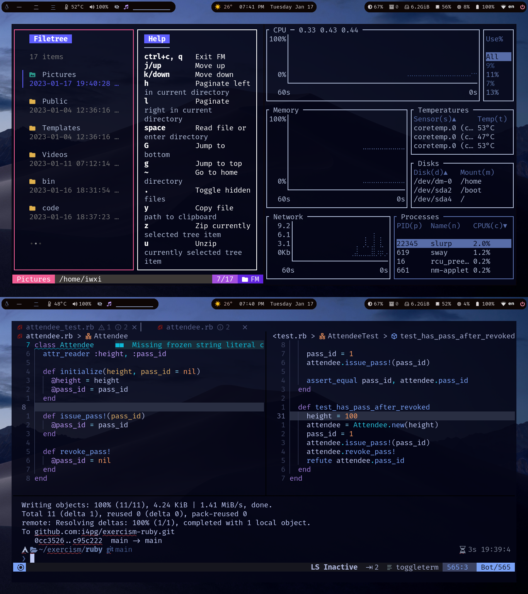
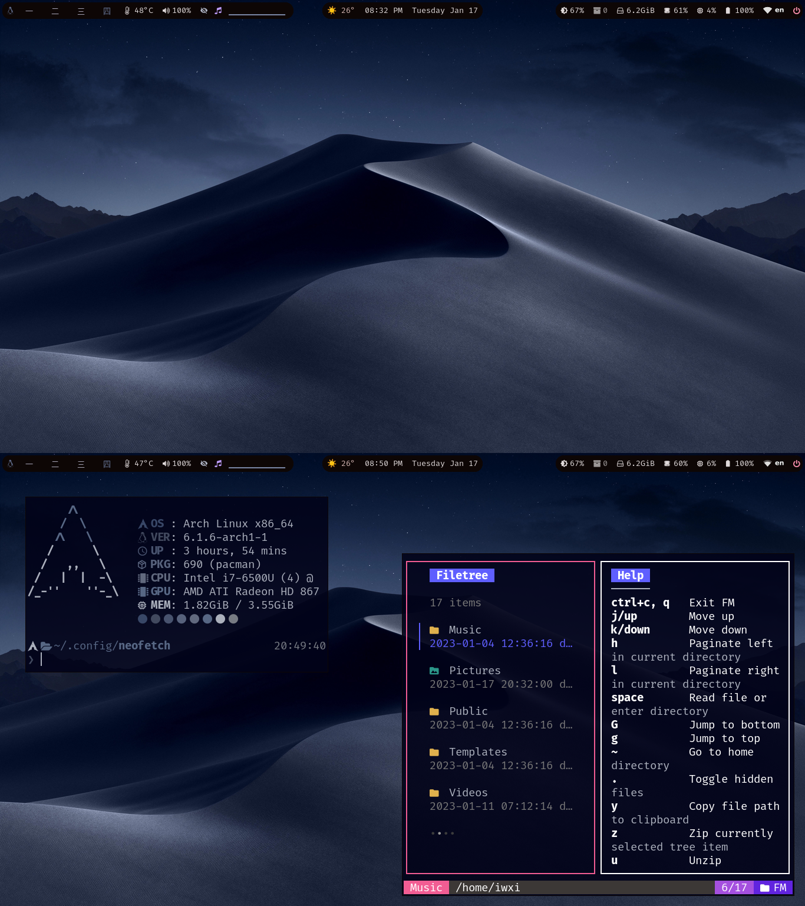
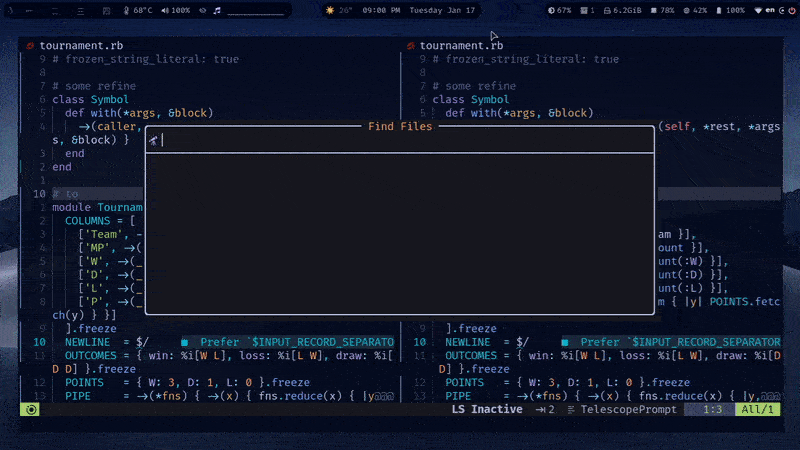

<h1 align="center">
Aesthetic SwayWM Environment
</h1>

This is a seamless configuration, where everything just works, but only for me. It is not inteded to be used as a 'starter' config, though there are some really cool snippets/configs that everyone can use, please refer to //TODO!

## Configuration :computer:

  
  
  

:octocat: _Those are some details about my setup_

+ **OS**							• [`arch`](https://archlinux.org/)
+ **WM**							• [`sway`](https://swaywm.org/)
+ **Bar**							• [`waybar`](https://github.com/Alexays/Waybar)
+ **Launcher**						• [`wofi`](https://man.archlinux.org/man/wofi.1.en)
+ **Font**							• [`Fira Code (Nerd)`](https://github.com/ryanoasis/nerd-fonts)
+ **Shell**							• [`fish`](https://fishshell.com/) 
+ **Terminal**						• [`kitty`](https://sw.kovidgoyal.net/kitty/) 
+ **Editor**						• [`lvim`](https://www.lunarvim.org/)
+ **Theme**							• [`catppuccin`](https://catppuccin.com/)
+ **Color Scheme**					• [`pywall`](https://github.com/dylanaraps/pywal) 
+ **Wallpapers**						• [`dwall`](https://github.com/adi1090x/dynamic-wallpaper) 
+ **Resource monitor**				• [`btm`](https://github.com/ClementTsang/bottom)
+ **File Manager**							• [`fm`](https://github.com/knipferrc/fm)
+ **Fuzzy finder**					• [`fzf`](https://github.com/junegunn/fzf) 
+ **Dotfiles Manager**						• [`chezmoi`](https://www.chezmoi.io/)
+ **System information**			• [`fastfetch`](https://github.com/LinusDierheimer/fastfetch)
+ **Reader**							• [`zathura`](https://pwmt.org/projects/zathura/) 
+ **Browser**						• [`firefox`](https://www.mozilla.org/en-US/firefox/new/)

## Thanks to…

* @flinner for [stolen his README](https://github.com/flinner/dots) 💜
